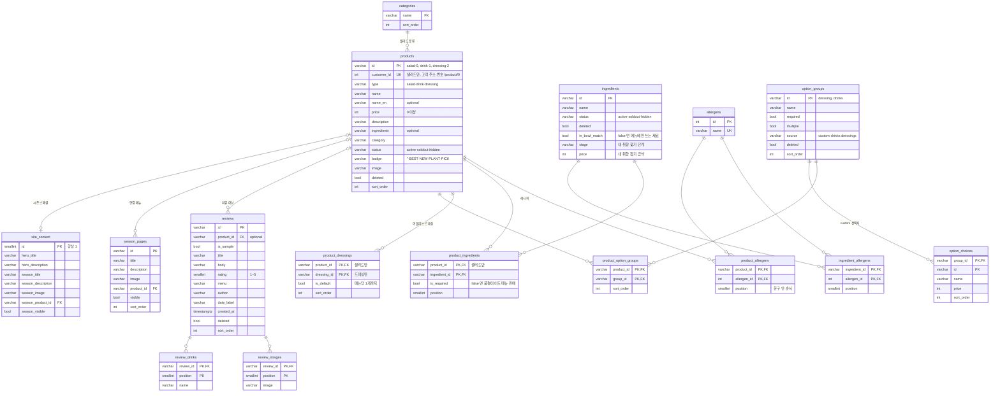
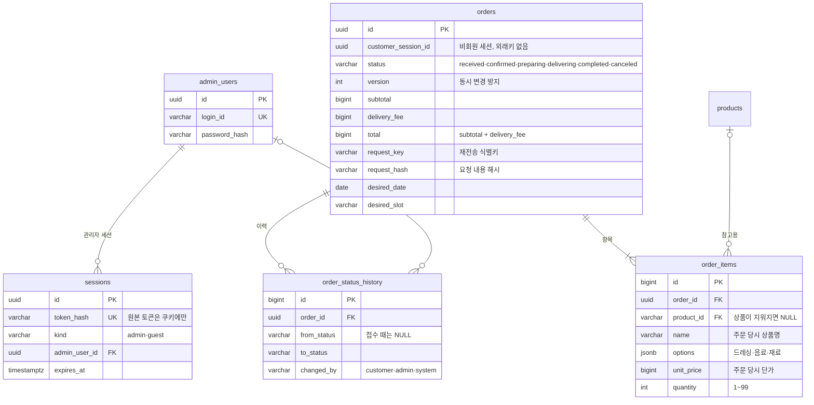

# leaf & bowl DB 설계

PostgreSQL · 정민님 원격 리눅스 서버에서 실행 · 작성: 안형준 (백엔드)

## 목표

관리자 기능(#16)은 지금 카탈로그 전체를 `.data/admin/catalog.json` 한 파일에 저장한다.
이 설계는 같은 데이터를 PostgreSQL 테이블로 옮긴다. **화면과 API(`/api/admin/catalog`)는 그대로 두고**,
`lib/admin/store.ts` 의 `readCatalog` · `writeCatalog` 안쪽만 DB 조회·저장으로 바꾸는 것이 목표다.

기준: `lib/admin/catalog.ts` 의 `catalogSchema` (main, #23 반영). PR #24 리뷰에 따라 알레르기는 연관 테이블, 리뷰 via 는 제외. 재료·재료 기준 자동 품절·메뉴별 드레싱은 아래 '재료와 재료 기준 자동 품절' 절에 추가.

## ERD



ERD 외에 1행짜리 테이블 2개가 더 있다: `catalog_meta` (저장 버전 revision), `store_location` (매장 위치).
재료(`ingredients`)와 관련 테이블은 아래 '재료와 재료 기준 자동 품절' 절에서 설명한다. 뷰 2개(`product_availability`, `bowl_match_ingredients`)도 그곳에 있다.

## 관리자 데이터 ↔ 테이블

| catalog.json | 테이블 |
| --- | --- |
| `revision`, `updatedAt` | catalog_meta |
| `location` | store_location |
| `categories[]` | categories (배열 순서 → sort_order) |
| `products[]` | products |
| `products[].optionIds[]` | product_option_groups |
| `groups[]` | option_groups |
| `groups[].choices[]` | option_choices |
| `products[].allergens` ("닭고기, 토마토") | allergens + product_allergens (쉼표로 나눠 저장, 읽을 때 position 순서로 다시 합침) |
| `ingredients[]` | ingredients, ingredient_allergens (+ 메뉴 전용 재료 13개를 추가) |
| `reviews[]` | reviews |
| `reviews[].images[]`, `reviews[].drinks[]` | review_images, review_drinks |
| `content` (seasonPages 제외) | site_content |
| `content.seasonPages[]` | season_pages |

이름 규칙: 코드의 camelCase 는 컬럼에서 snake_case (`detailAddress` → `detail_address`, `en` → `name_en`, `sample` → `is_sample`, `date` → `date_label`).
리뷰의 `via`(픽업·배달)는 저장하지 않는다. 수령 방식이 배달로 고정되었다.

## 설계 결정

| 결정 | 이유 |
| --- | --- |
| 관리자 카탈로그 구조를 그대로 따른다 | 화면·API 코드를 바꾸지 않고 저장소만 교체한다. 읽고 다시 쓰면 같은 JSON 이 나와야 한다 |
| 샐러드·음료·드레싱을 products 한 테이블, `type` 으로 구분 | 관리자 화면이 이미 한 목록으로 관리한다. 음료에도 BEST·NEW 뱃지가 있다 |
| 배열은 별도 테이블 + `sort_order`·`position` | 관리자가 정한 순서가 곧 화면 순서다 |
| id 는 문자열 그대로 (`salad-0`) | 관리자 화면이 id 를 만들고 옵션·시즌·리뷰가 그 id 로 서로를 가리킨다. 고객 주소용 숫자는 `customer_id` 로 따로 둔다 |
| 빈 문자열은 `''` 로 저장, optional 항목만 NULL | 관리자 데이터에서 `''`(비어 있음)와 "항목 없음"이 구분된다. 단 연결 id(`seasonProductId`, `productId`)의 `''` 는 외래키를 위해 NULL 로 바꿔 저장하고 읽을 때 `''` 로 되돌린다 |
| enum 대신 `VARCHAR + CHECK` | 값 목록이 zod 스키마와 같이 자주 바뀐다. CHECK 는 한 줄 수정으로 바뀌지만 ENUM 은 값 삭제가 어렵다 |
| 삭제는 `deleted` 플래그 | 관리자 화면이 삭제 후 복구를 지원한다. 리뷰·시즌이 가리키는 상품도 남아 있어야 한다 |
| 1행 테이블 (`id = 1` CHECK) | 매장 위치·메인 문구·저장 버전은 하나뿐이다 |
| 알레르기는 allergens + product_allergens 연관 테이블 (N:M) | 팀에서 연관 관계로 관리하기로 했다. "우유가 들어간 메뉴" 조회가 쉽고 같은 재료가 오타로 두 번 생기지 않는다(UNIQUE). 관리자 화면의 문구 입력은 그대로 두고 저장할 때 쉼표로 나눈다 |
| 정수 범위 체크 없음 (가격 0 이상·별점 1~5 만 유지) | 상한값(가격 100만 원, 사진 10장 등)은 zod 스키마가 이미 검사한다. DB 에는 값의 의미상 꼭 필요한 규칙만 둔다 |

## 재료와 재료 기준 자동 품절

요구: "연어가 품절이면 연어 샐러드는 자동으로 품절", "치킨이 품절이면 치킨이 든 여러 메뉴가 자동 품절", 같은 규칙을 **내 취향 찾기**에도 적용, 메뉴마다 **어울리는 드레싱**을 정한다.

### 추가한 것

| 이름 | 종류 | 역할 |
| --- | --- | --- |
| `ingredients` | 테이블 | 재료 31개: 내 취향 찾기 18 + **메뉴에만 쓰는 재료 13**(루콜라, 바질, 보리, 블랙빈, 스테이크, 양배추, 양파, 에다마메, 참치, 파르메산, 페타, 허브, 현미). `in_bowl_match` 로 구분한다 |
| `ingredient_allergens` | 테이블 | 재료별 알레르기 (상품과 같은 N:M) |
| `product_ingredients` | 테이블 | 메뉴 ↔ 재료(레시피). `is_required=false` 인 재료는 품절이어도 메뉴가 판매된다 |
| `product_dressings` | 테이블 | 메뉴 ↔ 어울리는 드레싱. `is_default` 는 메뉴당 1개까지 |
| `product_availability` | **뷰** | 메뉴의 실제 판매 상태와 품절 이유(재료 이름)를 **계산**해서 돌려준다 |
| `bowl_match_ingredients` | **뷰** | 내 취향 찾기 선택지. 품절 재료는 `available=false` 로 남긴다 |

### 판매 상태 계산 규칙

```
hidden   메뉴가 숨김 또는 삭제
soldout  메뉴가 품절이거나, 필수 재료 중 하나라도 품절·숨김·삭제
active   그 외
```

- **품절 여부를 메뉴에 저장하지 않는다.** 재료 상태에서 그때그때 계산하므로 "치킨은 품절인데 메뉴는 판매 중" 같은 어긋남이 생기지 않고, 재료를 복구하면 메뉴도 자동으로 돌아온다.
- 응답에 품절 이유(`soldout_ingredients`, 예: `["그릴 치킨"]`)를 같이 내려 화면에서 "치킨 품절로 주문이 어려워요"처럼 보여줄 수 있다.
- 내 취향 찾기에서는 품절 재료를 선택 불가로 두고, 추천에서는 `effective_status <> 'active'` 인 메뉴를 제외한다 (앱 규칙).

### DB 가 막아 주는 것

- `product_ingredients`·`product_dressings` 는 `product_type`·`dressing_type` 열이 항상 `'salad'`·`'dressing'` 으로 채워지고 `(id, type)` 외래키를 건다. 음료·드레싱 id 를 메뉴 자리에 넣거나 음료를 드레싱으로 연결하면 거부된다.
- 메뉴에 쓰이는 재료는 삭제할 수 없다 (`ON DELETE RESTRICT`). 삭제 대신 `deleted` 또는 품절로 처리한다.
- 내 취향 찾기 재료(`in_bowl_match`)는 단계·금액이 필수다. 메뉴 전용 재료는 없어도 된다.

### 검증 (PGlite, 실제 PostgreSQL)

`check_ingredients.mjs` 시나리오 30개 통과:

- 처음에는 샐러드 12개 모두 `active`
- 치킨 품절 → **레몬 치킨 아보카도·클래식 치킨 시저·스파이시 멕시칸 세트 3개가 자동 품절**, 이유 `["그릴 치킨"]`, 치킨 없는 메뉴는 그대로, 복구하면 자동 복구
- 연어 품절 → 연어 아보카도만, 메뉴 전용 재료(파르메산) 품절 → 스테이크 케일·클래식 치킨 시저만, 이때 내 취향 찾기 목록에는 변화 없음
- 선택 재료(`is_required=false`) 품절은 메뉴에 영향 없음, 메뉴를 직접 품절·숨김하거나 재료를 삭제한 경우도 규칙대로
- 잘못된 연결·중복 기본 드레싱·삭제 시도는 모두 거부

### 알아둘 점

- **메뉴 알레르기와 재료 알레르기 비교**: 재료에서 모은 알레르기와 지금 메뉴에 적힌 값이 12개 중 11개 같다. **클래식 치킨 시저**만 다르다 (메뉴에는 계란·생선이 있고 재료에는 없음. 시저 소스에 들어 있는 것으로 보이며 재료 목록에 소스가 없다). 그래서 메뉴 알레르기는 지금처럼 따로 저장하고, 재료는 대조용으로 쓴다.
- **샘플 데이터**: 메뉴 전용 재료 13개의 분류·알레르기(예: 보리→밀, 스테이크→쇠고기)와 메뉴별 드레싱(지금은 12개 메뉴에 드레싱 5개를 모두 허용)은 **예시 값**이다. 팀이 확정한 값으로 바꾼다.
- **세트에 포함된 음료**(오렌지 주스, 커피)는 재료가 아니라 음료 상품이라 연결하지 않았다. 음료 품절이 세트 품절로 이어져야 하는지는 정해야 한다.
- 관리자 데이터(`catalog.ts`)에 메뉴의 재료 목록(`ingredientIds`)과 드레싱 목록(`dressingIds`)이 있어야 이 표를 채울 수 있다 (관리자 화면 담당과 협의).

### 정해야 할 것

| # | 질문 | 이 문서의 가정 |
| --- | --- | --- |
| 1 | 메뉴 전용 재료 13개를 재료 테이블에 둔다 | 둔다. 내 취향 찾기에는 나오지 않는다 |
| 2 | 세트의 음료 품절이 세트 품절로 이어지나 | 이어지지 않는다 (미정) |
| 3 | 숨김·삭제 재료의 메뉴 | 품절과 똑같이 취급 |
| 4 | 선택 재료(토핑) 품절 | `is_required` 로 구분, 기본은 필수 |
| 5 | 메뉴별 드레싱 | 팀(매장 기준)이 확정. '드레싱 없이'는 항상 허용 |

## 주문과 인증

정민님 백엔드 설계안(PR #45)의 `Order`·`OrderItem`·`OrderStatusHistory`·`AdminUser`·`Session` 을 SQL 로 옮긴 것이다. 주문·인증 API는 PR #60에서 메모리 저장소로 구현되었으며, 아직 이 SQL의 DB 테이블에는 연결되지 않았다. 테이블 규칙이 설계대로 지켜지는지를 DB에서 먼저 확인했다.



### 설계안과 SQL 의 대응

| 설계안 | SQL |
| --- | --- |
| 주문 UUID, 상태, `version`, 주문자·연락처·주소·희망 시각, 상품 합계·배달비·총액 | `orders` 의 같은 이름 칸 (`total` 은 `subtotal + delivery_fee` 와 같아야 한다는 CHECK) |
| 고객 세션 ID 와 `requestKey` 복합 유일 | `UNIQUE (customer_session_id, request_key)` |
| `requestHash` | `request_hash` (같은 키로 다른 내용을 보내면 서비스가 409) |
| 금액은 원 단위, 합계는 BigInt | `BIGINT`. JSON 응답에서는 십진 문자열로 변환 |
| 주문 항목은 주문 당시 값의 스냅샷 | `order_items.name·options·unit_price`. `product_id` 는 참고용(상품이 지워지면 NULL) |
| 상태 변경 이력 | `order_status_history` |
| `(status, createdAt, id)` 검색용 인덱스와 마지막 주문 기준 다음 쪽 | `idx_orders_list (status, created_at DESC, id DESC)` |
| 관리자·비회원 구분 세션, 토큰 해시 | `sessions.kind`, `token_hash` |
| 비밀번호 해시 | `admin_users.password_hash` |
| 카탈로그 버전 행을 읽기·쓰기 잠금 | 기존 `catalog_meta` 행을 `FOR SHARE`(주문)·`FOR UPDATE`(관리자 저장)로 잠근다 |

### DB 가 한 번 더 막아 주는 것

- 상태 순서: `received → confirmed → preparing → delivering → completed`, 취소는 `received`·`confirmed` 에서만, 완료·취소는 더 바꿀 수 없다 (트리거). 서비스 코드가 실수해도 잘못된 상태가 저장되지 않는다.
- 취소 상태와 취소 시각은 함께 있어야 한다. 합계가 맞지 않으면 저장되지 않는다.
- 관리자 세션에는 관리자 계정이, 비회원 세션에는 없어야 한다.
- 수량은 1~99, 단가는 0 이상이다.
- 주문을 지우면 항목·이력이 함께 정리되고, 관리자 계정을 지우면 그 세션도 정리된다.

### 서비스가 맡는 것 (DB 만으로 안 되는 것)

- 같은 키로 다시 보내면: 같은 내용(`request_hash` 가 같음)이면 기존 주문을 반환, 다르면 409. 키 중복(`23505`/Prisma `P2002`)은 트랜잭션을 취소하고 기존 주문을 다시 읽어 처리한다.
- 상태 변경: `UPDATE ... WHERE id = ? AND version = ? AND status = ?` 로 바꾸고 변경 건수가 0 이면 409. 성공하면 `version + 1` 과 이력을 같은 트랜잭션에 저장한다.
- 가격 계산은 서버가 카탈로그에서 다시 한다 (화면이 보낸 가격을 믿지 않는다).
- 비밀번호 해시 계산, 세션 쿠키 설정, 요청 제한.

### 검증 (PGlite, 실제 PostgreSQL)

`check_orders.mjs` 시나리오 37개 통과: 주문 접수(주문·항목·이력 한 트랜잭션), 같은 키 재전송 중복 거부와 다른 세션 분리, 두 관리자가 같은 `version` 으로 바꿀 때 한 명만 성공, 허용되지 않는 상태 변경 거부, 취소 규칙, 상품 가격·이름이 바뀌거나 상품이 지워져도 주문 항목 유지, 항목 규칙, 세션 규칙, 관리자 목록의 다음 쪽 조회.

**한계**: 시험이 연결 1개라 "진짜 동시에 두 명"은 재현하지 못한다. `version` 조건이 0 건이 되어 덮어쓰기를 막는 논리까지만 확인했고, **읽기·쓰기 잠금(`FOR SHARE`/`FOR UPDATE`)은 실제 PostgreSQL 서버에서 따로 확인해야 한다.**

### 세션 정리와 상한

- 만료된 세션은 해당 토큰으로 다시 접근할 때만 지워지면 계속 쌓이므로, 세션을 발급할 때 1분에 한 번 `purgeExpired(now)` 로 쓸어낸다. DB 에서는 `DELETE FROM sessions WHERE expires_at <= $1` 이고 `idx_sessions_expires` 를 쓴다.
- 비회원 세션은 동시에 유효한 개수에 상한(10,000)을 둔다. 상한에 이르면 새 세션 발급은 503, 이미 가진 세션은 계속 쓸 수 있다. DB 에서는 `SELECT count(*) FROM sessions WHERE kind = 'guest' AND expires_at > $1` 로 센다.
- 요청 제한기(로그인·세션·주문)는 서버 메모리의 임시 장치다. 서버가 여러 대가 되면 DB 나 Redis 로 옮겨야 한다.

### 저장소 트랜잭션 계약 (제안, 정민님과 합의 필요)

"DB 가 준비되면 `container.ts` 에서 저장소만 바꾸면 된다"는 말은 **route 와 service 의 업무 규칙은 그대로 둔다**는 뜻에서만 맞다. 지금의 저장소 계약(`modules/orders/repository.ts`)은 설계안(`docs/backend-design.md` "주문 API와 트랜잭션 처리")이 요구하는 트랜잭션을 표현하지 못해서, DB 를 붙일 때 **계약 자체를 아래처럼 바꿔야** 한다.

**설계안과 현재 구현의 차이**

| 설계안 | 현재 구현 | 차이 |
| --- | --- | --- |
| 기존 키 확인 → 상품 검증·가격 계산 → 주문·항목·이력 저장을 `prisma.$transaction` 한 번에 | `findByRequest`, `getCatalog`, `create` 가 각각 따로 호출된다. `create` 안에서만 주문·항목·접수 이력을 한 번에 저장한다 | 키 확인과 카탈로그 읽기가 저장과 같은 트랜잭션에 묶이지 않는다 |
| Service 가 연 `tx` 를 모든 Repository 호출에 전달 | `tx` 개념이 계약에 없다 | Repository 가 트랜잭션을 스스로 열면 service 가 앞선 읽기를 포함시킬 수 없다 |
| 카탈로그 버전 행을 읽기 잠금(`FOR SHARE`), 관리자 저장은 쓰기 잠금(`FOR UPDATE`) | `getCatalog()` 는 파일 저장소를 읽고 잠금이 없다 | 가격 계산 중 관리자가 상품을 바꿔도 막지 못한다 |
| 상태 변경: 조건부 갱신 + `version + 1` + 이력을 한 트랜잭션에 | `updateStatus` 한 메서드 안에서 처리한다는 주석뿐 | 계약에 "셋이 함께 성공하거나 함께 취소"가 명시되어 있지 않다 |

**실제 PostgreSQL 엔진(PGlite)으로 확인한 동작** (`schema.sql` 의 `orders`, `order_status_history`)

| 시도 | 결과 |
| --- | --- |
| 같은 트랜잭션 안에서 `(customer_session_id, request_key)` 중복 INSERT | `23505` 오류. 이 트랜잭션은 **중단 상태**가 되어 이어지는 SELECT 도 `current transaction is aborted` 로 실패한다 |
| 롤백 후 새 트랜잭션에서 기존 주문 재조회 | 가능 |
| `SAVEPOINT` 로 INSERT 를 감싸고 오류 시 `ROLLBACK TO SAVEPOINT` | 같은 트랜잭션에서 재조회 가능 |
| `INSERT ... ON CONFLICT (customer_session_id, request_key) DO NOTHING RETURNING id` | 오류 없이 0행, 같은 트랜잭션에서 재조회 가능 |
| 상태 `UPDATE` 후 이력 INSERT 가 실패 | 롤백하면 `status`, `version` 이 원래대로 돌아온다 (둘은 한 트랜잭션이어야 한다) |

즉 **P2002 처리는 "트랜잭션을 끝낸 뒤 밖에서 기존 주문을 다시 읽는" 구조여야 한다.** 지금 service 의 `catch (DuplicateRequestError) → findByRequest` 는 이 구조라 그대로 쓸 수 있지만, 그 재조회는 반드시 실패한 트랜잭션 **밖**의 호출이어야 한다.

**제안하는 최소 계약** (코드는 아직 바꾸지 않았다. 합의 후 DB 연결 때 함께 적용)

```ts
/** 하나의 DB 트랜잭션 안에서만 쓰는 연산. 콜백 밖으로 꺼내 쓰지 않는다 */
interface OrdersTx {
  readCatalog(): Promise<Catalog>;                 // 카탈로그 버전 행 FOR SHARE 후 같은 트랜잭션에서 읽기
  findByRequest(sessionId: string, key: string): Promise<OrderRecord | null>;
  insertOrder(order: NewOrder): Promise<OrderRecord>;   // 주문 + 항목 + 접수 이력. 키 중복이면 DuplicateRequestError
  findById(id: string): Promise<OrderRecord | null>;
  /** id + version + status 조건 갱신, version + 1, 취소 시각·사유, 상태 이력 INSERT 를 모두 이 트랜잭션에서. 조건이 안 맞으면 null */
  updateStatus(update: StatusUpdate): Promise<OrderRecord | null>;
}

interface OrdersRepository {
  /** fn 이 던지면 전체를 롤백하고 그 오류를 다시 던진다. 일시적 충돌(P2034)은 최대 3회 다시 실행한다 */
  transaction<T>(fn: (tx: OrdersTx) => Promise<T>): Promise<T>;
  // 트랜잭션이 필요 없는 읽기
  findByRequest(sessionId: string, key: string): Promise<OrderRecord | null>;
  findById(id: string): Promise<OrderRecord | null>;
  list(query: ListQuery): Promise<OrderRecord[]>;
}
```

규칙

1. `transaction` 의 콜백은 **다시 실행되어도 안전**해야 한다(P2034 재시도). 콜백 안에서 파일 업로드 같은 외부 호출을 하지 않는다.
2. 주문 생성은 한 콜백 안에서 `findByRequest → readCatalog → 가격 계산·검증 → insertOrder` 를 한다. `DuplicateRequestError` 는 콜백 밖에서 잡아 `repository.findByRequest` 로 다시 읽고 해시를 비교한다(같으면 기존 주문, 다르면 409).
3. 상태 변경·취소는 `transaction(tx => tx.updateStatus(...))` 로 한다. 상태·`version`·이력이 한 번에 반영되거나 한 번에 취소된다. 취소가 관리자 변경과 겹쳐 `null` 이면 service 가 최신 상태를 다시 읽어 판단한다(현재 구현 그대로).
4. 메모리 구현은 같은 계약으로 쓸 수 있다: `transaction` 이 변경을 임시 버퍼에 쓰고 콜백이 성공하면 반영, 실패하면 버린다.

**정민님과 합의할 것**

1. 위 계약의 방향(`transaction` + `OrdersTx`)이 설계안의 의도와 맞는지.
2. 카탈로그 읽기 잠금을 `OrdersTx.readCatalog()` 로 둘지, `modules/catalog` 가 `tx` 를 받아 읽게 할지 (카탈로그 저장소 통합 담당과 맞춰야 한다).
3. 격리 수준: 기본(READ COMMITTED) + 조건부 `UPDATE` + 카탈로그 `FOR SHARE` 로 충분한지.

이 절은 **제안**이다. Prisma 저장소 구현이나 `docs/backend-design.md` 의 수정은 포함하지 않는다.

### 이번에 넣지 않은 것

- 고객 계정(회원): 설계안은 "고객 세션"만 있다. 프론트의 로그인·마이페이지(#55, mock)와 맞추려면 고객 계정 테이블이 필요하며, 범위는 팀 결정을 기다린다.
- 결제(PG): 별도 범위.
- 주문 알림, 매장 관리: 제외.

## 저장 방식 (store.ts 교체 계획)

`lib/admin/store.ts` (#23 기준)의 공개 함수 3개를 DB 로 바꾼다. 호출하는 API·화면은 그대로 둔다.

| 함수 | 지금 (파일) | DB |
| --- | --- | --- |
| `readCatalog()` | catalog.json 읽기. 없으면 `customerSeed()` 로 생성, schemaVersion 이 3 이 아니면 `migrateCatalog` 후 저장 | 테이블을 읽어 Catalog 객체로 조립. 비어 있으면 `customerSeed()` 를 넣고 revision 1 |
| `writeCatalog(catalog, revision)` | 파일 잠금 → revision 비교 → 샐러드에 `customerId` 부여(기존 값 유지, 새 메뉴는 최댓값+1, 최소 12) → `migrateCatalog` → 저장 | **트랜잭션** 안에서 `catalog_meta` 를 `FOR UPDATE` 로 잠그고 revision 비교 → 다르면 null(409) → 같은 규칙으로 `customer_id` 부여 → 테이블 내용 교체 + revision + 1 |
| `appendCustomerReview(input)` | 고객이 쓴 리뷰 1개 추가. `customerId` 로 판매 중인 샐러드를 찾고, 같은 id 리뷰가 있으면 그대로 반환, 500개 한도 | 트랜잭션 안에서 `products` 조회(`customer_id`, `type = 'salad'`, `deleted = false`, `status <> 'hidden'`) → `reviews` 에 INSERT → revision + 1 |

- 관리자 화면은 저장할 때마다 카탈로그 전체를 보내므로(PUT), `writeCatalog` 는 처음에는 "전체 교체" 방식으로 단순하게 구현한다.
- 트랜잭션이라 중간에 실패하면 이전 상태가 그대로 남는다.
- `customer_id` 는 샐러드만 가진다 (음료·드레싱은 NULL). 기존 0~11번은 고객 주소(/product/0)와 같다.
- 파일 방식의 `schemaVersion`·`migrateCatalog` 는 예전 JSON 을 옮길 때만 필요하다. DB 는 스키마가 곧 버전이므로 마이그레이션 SQL 로 관리한다.

## 실행 방법

```bash
psql "$DATABASE_URL" -f db/schema.sql
psql "$DATABASE_URL" -f db/seed.sql
```

DBeaver 에서는 SQL 편집기에 파일 내용을 붙여넣고 **스크립트 실행(Alt+X)** 으로 schema.sql → seed.sql 순서로 실행한다.
초기 데이터는 `customerSeed()`(파일 저장소가 처음 만들어질 때와 같은 데이터) 결과를 옮긴 것이다:
상품 21 (샐러드 12 · 음료 4 · 드레싱 5) · 알레르기 15종 · 상품-알레르기 연결 28 · 분류 4 · 옵션 그룹 2 · 리뷰 48 · 재료 31 · 메뉴-재료 49 · 메뉴-드레싱 60.

## 확인할 것

- [ ] 정민님: 테이블 구조 검토, DB 이름·계정 생성, DATABASE_URL 전달
- [ ] 서현님: store.ts 의 readCatalog·writeCatalog·appendCustomerReview 를 DB 로 바꾸는 것 동의, catalog.ts 변경 계획 공유
- [ ] DB 접근 방식: Prisma (정민님 설계 PR #45). 이 문서의 `db/schema.sql` 은 기존 DB 를 `db pull` 로 가져올 때 기준(baseline)이 된다
- [ ] 재료·메뉴별 드레싱: 위 '정해야 할 것' 5개, 관리자 화면의 재료·드레싱 선택 (서현님)
- [ ] 주문·인증: 비회원 주문 조회 방식(세션이 만료되면 본인 주문을 어떻게 확인하나), 주문·개인정보 보관 기간, 배달 가능 조건 (설계안의 미정 사항)
- [ ] 실제 PostgreSQL 서버에서 읽기·쓰기 잠금 동시성 시험
